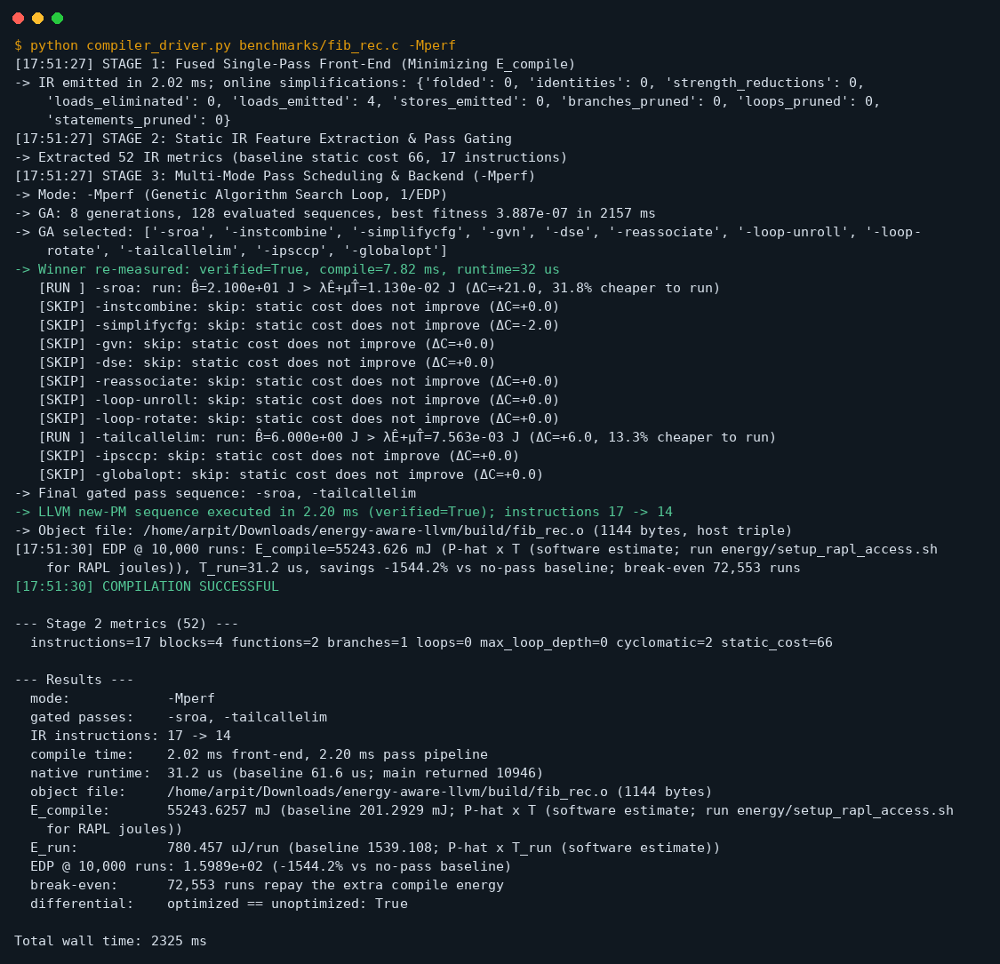
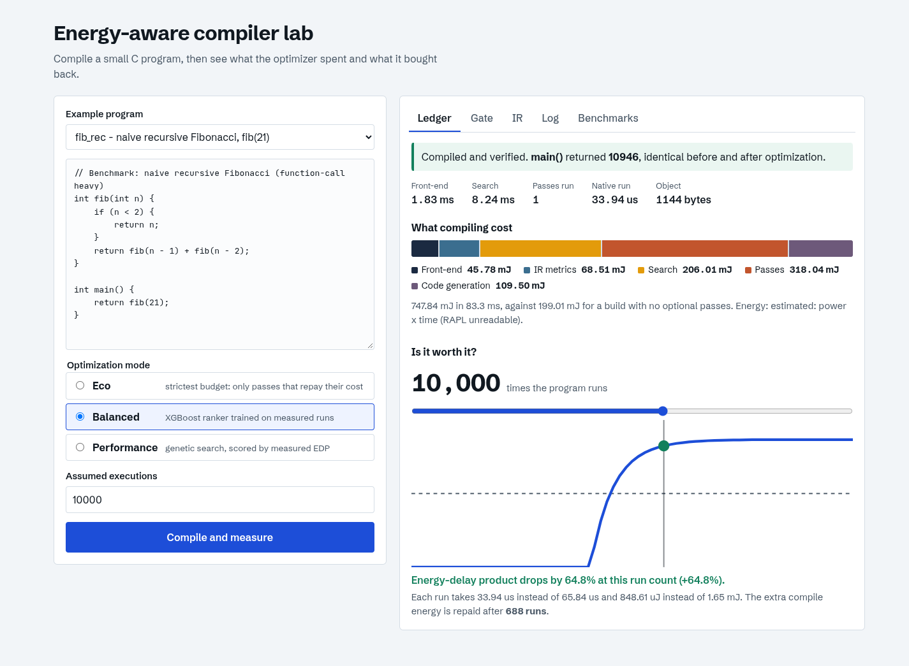
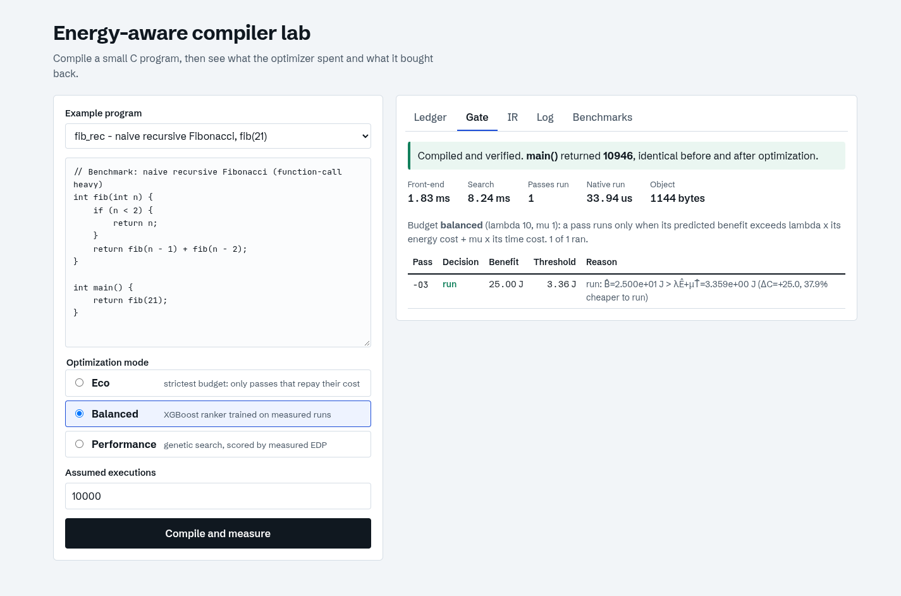
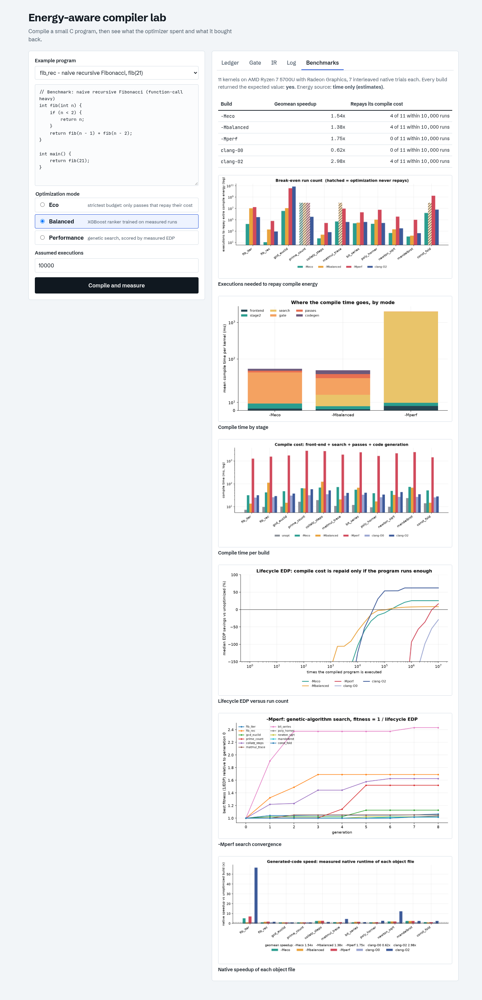

# Energy-Aware Compiler Optimization Lab

A small research compiler (a C subset, "MiniC") that treats **energy as a cost
of compiling**, not only of running. It implements the framework from
`compiler.pdf` and `Architecture of the Project.jpeg`:

1. **Stage 1 - fused front-end.** One traversal resolves names, checks types,
   folds constants, simplifies algebra and emits typed LLVM IR, so less work is
   handed to later stages (`E_compile` goes down).
2. **Stage 2 - IR metrics and pass gating.** 52 static IR metrics and a
   cost-benefit rule: an optional pass runs only if its predicted benefit
   exceeds `lambda x energy + mu x time`.
3. **Stage 3 - three scheduling modes** over real LLVM passes, a real object
   file and a real native run:
   `-Meco` (strict budget), `-Mbalanced` (XGBoost ranker trained on measured
   runs) and `-Mperf` (genetic search scored by measured energy-delay product).

Everything reported is measured: wall times, native runtimes of the emitted
object files, object sizes. Energy is RAPL package joules when the counter is
readable and a *labelled* `P-hat x T` estimate otherwise (see
[Energy measurement](#energy-measurement)). Nothing is simulated.



## What the measurements say

11 kernels, 7 builds each, every object linked and run natively
(AMD Ryzen 7 5700U, details in
[reports/benchmarks/RESULTS.md](reports/benchmarks/RESULTS.md)):

| build | geomean speedup vs no passes | repays its compile cost within 10,000 runs |
|---|---:|---:|
| `-Meco` | 1.54x | 4 of 11 kernels |
| `-Mbalanced` | 1.38x | 4 of 11 kernels |
| `-Mperf` | 1.75x | 0 of 11 kernels |
| clang `-O2` (reference) | 2.98x | 4 of 11 kernels |

The honest reading:

- Optimization is worth its compile energy only when the program runs enough
  times. `fib_rec` under `-Mbalanced` cuts EDP by 64.8% at 10,000 runs and
  breaks even after 688; tiny kernels (`gcd_euclid`, `const_fold`) never repay
  even `-Meco`.
- `-Mperf` produces the fastest code of the three modes but pays for its
  genetic search (about 1.5-2.8 s per compile here), so it only breaks even for
  programs that run millions of times.
- The `-Mbalanced` ranker generalizes modestly. Leave-one-benchmark-out, it
  realizes **+14.1%** mean EDP savings (no worse than baseline on 8 of 11
  held-out programs) against +14.9% for the best fixed pass list and -55% for
  `-O2` ([reports/ml/loo_evaluation.md](reports/ml/loo_evaluation.md)). With 11
  training programs that is what to expect.
- The unified front-end never emits more IR instructions than the conventional
  pipeline (a tested invariant on every kernel) and far fewer on constant-heavy
  code (33 -> 18).


## The web lab

Pick an example kernel, choose a mode and compile. The **Ledger** shows what
compiling cost per stage and lets you drag the number of executions to watch
EDP flip from loss to saving.



| Gate decisions | Measured benchmarks |
|---|---|
|  |  |

## Quick start

```bash
python3 -m venv venv
./venv/bin/pip install -r requirements.txt

./venv/bin/python compiler_driver.py benchmarks/fib_rec.c -Mbalanced
./venv/bin/python compiler_driver.py benchmarks/mandelbrot.c -Mperf --runs 1000000

./venv/bin/python api.py                         # API on :5000
cd web-app && npm install && npm run dev         # UI on :5173
```

`make help` lists the common tasks (`make test`, `make bench`, `make report`,
`make dataset`, `make evaluate`).

## Reproducing the results

```bash
./venv/bin/python -m pytest tests -q                       # 273 tests
./venv/bin/python benchmarks/run_benchmarks.py             # ~85 s, writes reports/benchmarks
./venv/bin/python benchmarks/report_benchmarks.py          # charts + RESULTS.md
./venv/bin/python -m ml_models.collect_dataset             # measured training data
./venv/bin/python -m ml_models.train
./venv/bin/python -m ml_models.evaluate                    # leave-one-benchmark-out
```

Do not run other heavy work during `run_benchmarks.py`: trials are interleaved
to cancel drift, but a busy machine still widens the spread.

## Energy measurement

`energy/` implements the plan's methodology: RAPL counters with wrap handling,
idle-power subtraction (`E = E_raw - P_idle x T`), warm-up, batching of short
runs, at least 20 interleaved paired trials, median/IQR/bootstrap CI.

Counters under `/sys/class/powercap` are root-only. Grant read access with
either of:

```bash
sudo energy/setup_rapl_access.sh direct   # chmod a+r, until reboot (most accurate)
sudo energy/setup_rapl_access.sh          # NOPASSWD rule for `cat` on the counters
sudo energy/setup_rapl_access.sh revert
```

Without access every energy column is labelled *estimated* (`P-hat x T`) and
conclusions rest on measured time. On AMD parts the driver exposes package
energy only (no DRAM domain). Because the estimate is proportional to time, it
cannot reveal a case where energy and time disagree; only RAPL can.

### Lifecycle EDP

`E_compile x T_run` mixes a one-off cost with a per-run delay. This project
models a program that is compiled once and run `n` times:

```
E(n) = E_compile + n x E_run        T(n) = T_compile + n x T_run
EDP(n) = E(n) x T(n)                break-even n = extra compile energy / energy saved per run
```

The baseline build is the same front-end with no optional passes; both builds
are charged for their own machine-code generation, and `-Mperf` is charged for
its search. See [docs/METHODOLOGY.md](docs/METHODOLOGY.md).

## Project layout

```
frontend/        Stage 1: lexer, parser, typed AST, conventional baseline emitter,
                 simplifying IR builder, unified semantic visitor, numeric semantics
stage2/          52-metric extractor (llvmlite binding walk) and cost-benefit gate
backend/         LLVM new-pass-manager runner, native link/run, timing harness
ml_models/       dataset collection, XGBoost training, GA search (-Mperf), evaluation
energy/          RAPL reader, harness, meter, statistics, lifecycle EDP, JIT
benchmarks/      11 kernels, independent reference results, runner and report
compile_pipeline.py   Stages 1-3 end to end (shared by CLI and API)
compiler_driver.py    command-line driver        api.py   Flask API
web-app/         React + Vite UI                 tests/   273 tests
docs/            architecture, methodology, screenshots
```

Architecture and the language subset are described in
[docs/ARCHITECTURE.md](docs/ARCHITECTURE.md); the original analysis and phase
plan is in [PLAN.md](PLAN.md).

## Language subset

`int` (32-bit two's complement) and `float` (binary32); functions with
parameters, calls and recursion; `if/else`, `while`; `return`; arithmetic
`+ - * / %`, comparisons, unary `-` and `!`; `//` and `/* */` comments. Implicit
int/float conversions follow C. Float literals are `float` (not `double` as in C),
so the clang reference is compiled from float-suffixed source.

Compile-time folding reproduces target semantics (wraparound, binary32
rounding, NaN comparisons) and is checked against the conventional pipeline and
against C by differential tests.

## Known limits

- Kernels run for microseconds, so their timings sit near the noise floor;
  speedup ratios on the smallest kernels are not meaningful.
- The compiler is Python/llvmlite, clang is C++: absolute compile times are
  not comparable, only their shape.
- No `for`/`break`/`continue`, `&&`/`||`, arrays or pointers yet.
- Energy numbers need RAPL access (see above); this repository's committed
  results were produced without it and say so.
