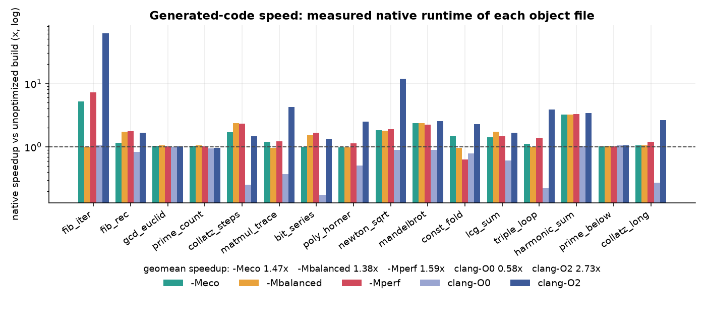
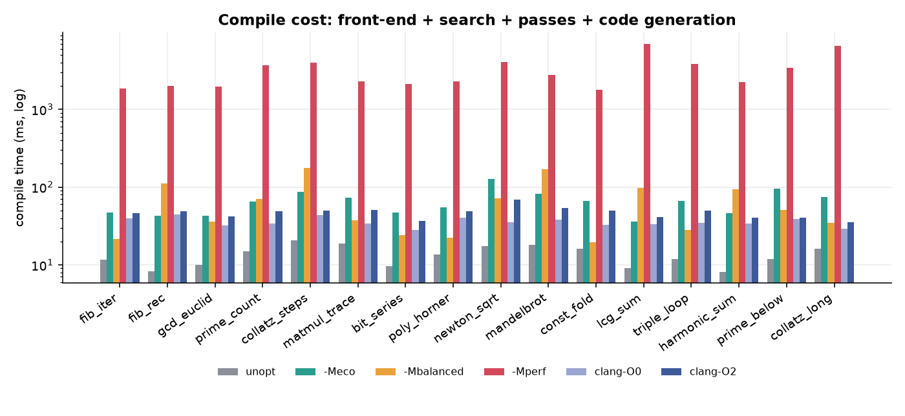
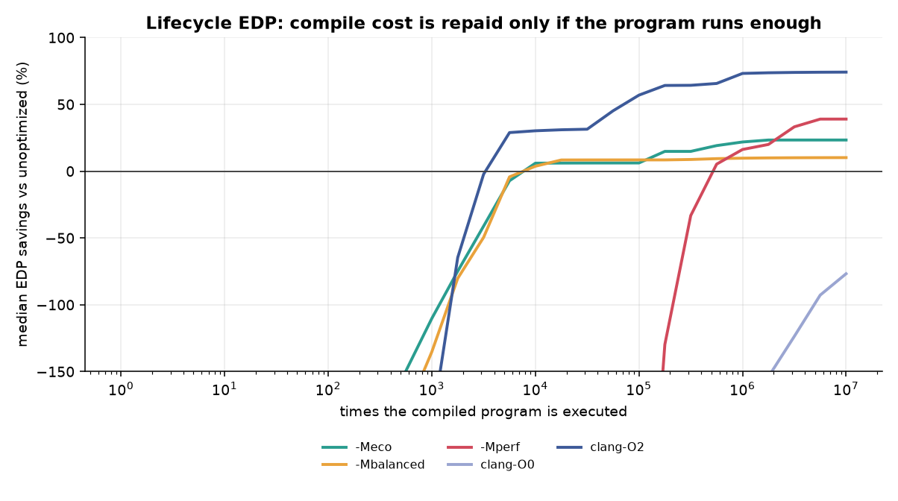
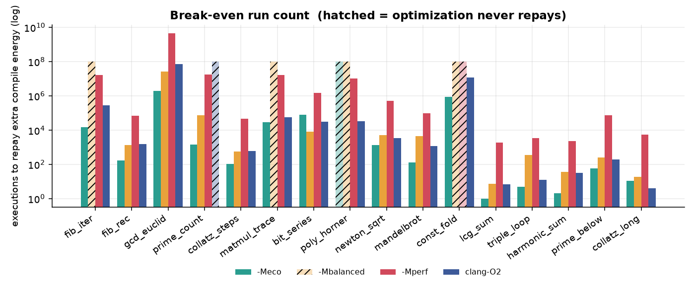
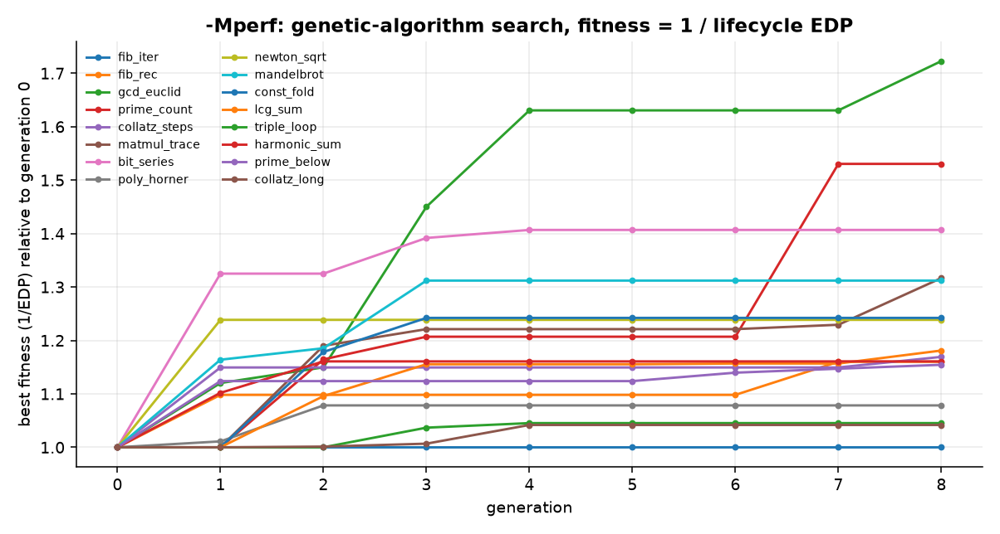
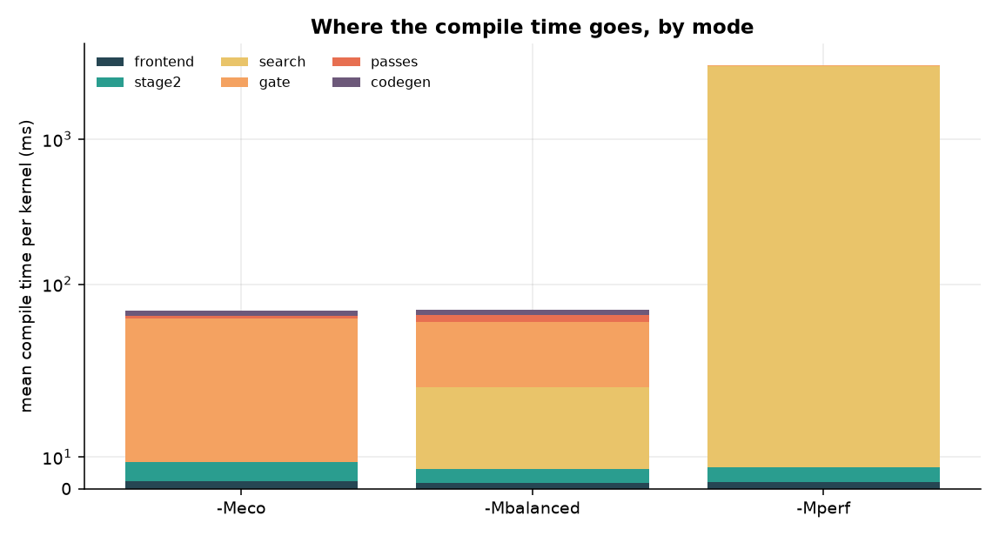

# Benchmark results

Generated 2026-10-04T18:29:13 on **AMD Ryzen 7 5700U with Radeon Graphics** (Linux 7.1.11-arch1-1, Python 3.14.7); 16 kernels, 20 interleaved native trials each, lifecycle EDP at 10,000 executions.

**RAPL was not readable** when this run was made, so energy is the labelled estimate `P-hat x T` (P-hat = 25 W) and every claim below rests on measured *time*.

All objects were linked and run natively; every build below returned the manifest value (`correct` column). Run time is the median of 20 interleaved trials of `backend/native_harness.c` calling the emitted object's `main` in a tight loop.

## Summary

| build | geomean speedup vs unopt | median EDP savings @ 10,000 runs | kernels where it repays compile cost |
|---|---:|---:|---:|
| -Meco | 1.47x | +6.0% | 10/16 |
| -Mbalanced | 1.38x | +3.7% | 10/16 |
| -Mperf | 1.59x | -27653.7% | 4/16 |
| clang-O0 | 0.58x | -316.6% | 2/16 |
| clang-O2 | 2.73x | +30.2% | 9/16 |

## Per kernel

| kernel | build | correct | run (us) | speedup | compile (ms) | break-even runs | EDP savings @ 1 / 10k / 1M runs | passes |
|---|---|:-:|---:|---:|---:|---:|---|---|
| fib_iter | unopt | yes | 0.13 | 1.00x | 11.7 | 0 | +0% / +0% / +0% | - |
| fib_iter | -Meco | yes | 0.02 | 5.20x | 47.5 | 15,496 | -360% / -284% / +86% | -sroa |
| fib_iter | -Mbalanced | yes | 0.13 | 1.00x | 21.3 | never | -219% / -192% / -14% | - |
| fib_iter | -Mperf | yes | 0.02 | 7.27x | 1848.7 | 16,877,476 | -2477693% / -2021888% / -18309% | -sroa -instcombine |
| fib_iter | clang-O0 | yes | 0.12 | 1.06x | 39.7 | 3,917,502 | -1048% / -893% / -33% | - |
| fib_iter | clang-O2 | yes | 0.00 | 61.08x | 46.1 | 278,818 | -1450% / -1166% / +88% | - |
| fib_rec | unopt | yes | 64.95 | 1.00x | 8.2 | 0 | +0% / +0% / +0% | - |
| fib_rec | -Meco | yes | 55.73 | 1.17x | 42.6 | 174 | -519% / +21% / +26% | -sroa |
| fib_rec | -Mbalanced | yes | 37.39 | 1.74x | 111.4 | 1,386 | -7544% / +53% / +67% | -O3 |
| fib_rec | -Mperf | yes | 37.03 | 1.75x | 2022.8 | 71,367 | -5982459% / -1212% / +64% | -sroa -tailcallelim |
| fib_rec | clang-O0 | yes | 77.36 | 0.84x | 44.1 | never | -2791% / -55% / -42% | - |
| fib_rec | clang-O2 | yes | 38.72 | 1.68x | 49.0 | 1,555 | -3449% / +56% / +64% | - |
| gcd_euclid | unopt | yes | 0.02 | 1.00x | 10.1 | 0 | +0% / +0% / +0% | - |
| gcd_euclid | -Meco | yes | 0.02 | 1.04x | 42.8 | 2,029,441 | -385% / -378% / -127% | -sroa |
| gcd_euclid | -Mbalanced | yes | 0.02 | 1.06x | 36.0 | 26,939,689 | -1145% / -1116% / -271% | - |
| gcd_euclid | -Mperf | yes | 0.02 | 1.03x | 1974.3 | 4,558,932,620 | -3829637% / -3708544% / -563508% | -instcombine -gvn -dse |
| gcd_euclid | clang-O0 | yes | 0.02 | 1.01x | 32.2 | 163,412,807 | -924% / -902% / -236% | - |
| gcd_euclid | clang-O2 | yes | 0.02 | 1.03x | 41.8 | 70,621,576 | -1626% / -1584% / -377% | - |
| prime_count | unopt | yes | 10.20 | 1.00x | 15.0 | 0 | +0% / +0% / +0% | - |
| prime_count | -Meco | yes | 9.84 | 1.04x | 65.3 | 1,411 | -350% / -36% / +7% | -sroa |
| prime_count | -Mbalanced | yes | 9.66 | 1.06x | 71.0 | 75,233 | -1653% / -86% / +9% | -sroa -simplifycfg |
| prime_count | -Mperf | yes | 10.00 | 1.02x | 3713.3 | 18,253,961 | -6060032% / -105182% / -80% | -sroa -instcombine -simplifycfg |
| prime_count | clang-O0 | yes | 10.71 | 0.95x | 33.8 | never | -407% / -45% / -11% | - |
| prime_count | clang-O2 | yes | 10.52 | 0.97x | 49.1 | never | -969% / -74% / -7% | - |
| collatz_steps | unopt | yes | 148.67 | 1.00x | 20.7 | 0 | +0% / +0% / +0% | - |
| collatz_steps | -Meco | yes | 87.14 | 1.71x | 86.7 | 105 | -445% / +62% / +66% | -sroa -instcombine |
| collatz_steps | -Mbalanced | yes | 62.26 | 2.39x | 176.9 | 588 | -2823% / +76% / +82% | -O3 |
| collatz_steps | -Mperf | yes | 63.48 | 2.34x | 4033.3 | 46,703 | -3725049% / -852% / +79% | -sroa -instcombine -simplifycfg -gvn |
| collatz_steps | clang-O0 | yes | 586.54 | 0.25x | 43.6 | never | -350% / -1437% / -1456% | - |
| collatz_steps | clang-O2 | yes | 100.09 | 1.49x | 49.8 | 601 | -476% / +51% / +55% | - |
| matmul_trace | unopt | yes | 0.73 | 1.00x | 18.9 | 0 | +0% / +0% / +0% | - |
| matmul_trace | -Meco | yes | 0.61 | 1.20x | 72.5 | 30,139 | -356% / -227% / +23% | -sroa -instcombine |
| matmul_trace | -Mbalanced | yes | 0.75 | 0.97x | 37.3 | never | -274% / -184% / -11% | - |
| matmul_trace | -Mperf | yes | 0.59 | 1.24x | 2318.2 | 16,280,284 | -1476197% / -774480% / -1398% | -instcombine -gvn -dse -lcsr |
| matmul_trace | clang-O0 | yes | 1.96 | 0.37x | 34.1 | never | -224% / -319% / -613% | - |
| matmul_trace | clang-O2 | yes | 0.17 | 4.22x | 50.4 | 56,639 | -608% / -295% / +91% | - |
| bit_series | unopt | yes | 3.41 | 1.00x | 9.5 | 0 | +0% / +0% / +0% | - |
| bit_series | -Meco | yes | 3.38 | 1.01x | 47.4 | 82,874 | -533% / -96% / +1% | -sroa -instcombine |
| bit_series | -Mbalanced | yes | 2.24 | 1.52x | 24.3 | 8,073 | -405% / -2% / +56% | -sroa -simplifycfg |
| bit_series | -Mperf | yes | 2.05 | 1.66x | 2113.4 | 1,536,388 | -4849809% / -236741% / -48% | -sroa -instcombine -simplifycfg |
| bit_series | clang-O0 | yes | 19.20 | 0.18x | 28.1 | never | -770% / -2447% / -3066% | - |
| bit_series | clang-O2 | yes | 2.53 | 1.35x | 36.7 | 30,868 | -1378% / -102% / +44% | - |
| poly_horner | unopt | yes | 1.70 | 1.00x | 13.6 | 0 | +0% / +0% / +0% | - |
| poly_horner | -Meco | yes | 1.72 | 0.99x | 55.3 | never | -370% / -154% / -4% | -sroa |
| poly_horner | -Mbalanced | yes | 1.74 | 0.98x | 22.3 | never | -158% / -64% / -5% | - |
| poly_horner | -Mperf | yes | 1.48 | 1.15x | 2315.3 | 10,283,477 | -2889627% / -575065% / -386% | -sroa -instcombine |
| poly_horner | clang-O0 | yes | 3.36 | 0.51x | 40.6 | never | -797% / -489% / -293% | - |
| poly_horner | clang-O2 | yes | 0.68 | 2.50x | 49.0 | 34,682 | -1208% / -233% / +82% | - |
| newton_sqrt | unopt | yes | 16.21 | 1.00x | 17.2 | 0 | +0% / +0% / +0% | - |
| newton_sqrt | -Meco | yes | 8.83 | 1.83x | 128.4 | 1,378 | -1080% / +22% / +70% | -sroa -gvn |
| newton_sqrt | -Mbalanced | yes | 9.03 | 1.80x | 71.5 | 5,148 | -1201% / +27% / +69% | -sroa -instcombine -simplifycfg -gvn |
| newton_sqrt | -Mperf | yes | 8.45 | 1.92x | 4045.8 | 509,273 | -5385884% / -51962% / +41% | -sroa -instcombine -gvn -loop-rotate |
| newton_sqrt | clang-O0 | yes | 18.08 | 0.90x | 35.6 | never | -325% / -46% / -25% | - |
| newton_sqrt | clang-O2 | yes | 1.36 | 11.92x | 68.6 | 3,456 | -1477% / +79% / +99% | - |
| mandelbrot | unopt | yes | 49.57 | 1.00x | 18.1 | 0 | +0% / +0% / +0% | - |
| mandelbrot | -Meco | yes | 21.11 | 2.35x | 81.3 | 134 | -443% / +74% / +82% | -sroa -instcombine |
| mandelbrot | -Mbalanced | yes | 21.08 | 2.35x | 169.6 | 4,439 | -7365% / +49% / +82% | -sroa -gvn |
| mandelbrot | -Mperf | yes | 22.31 | 2.22x | 2810.2 | 101,148 | -2373997% / -3345% / +74% | -sroa -gvn |
| mandelbrot | clang-O0 | yes | 55.28 | 0.90x | 38.1 | never | -342% / -32% / -24% | - |
| mandelbrot | clang-O2 | yes | 19.38 | 2.56x | 54.2 | 1,195 | -794% / +77% / +85% | - |
| const_fold | unopt | yes | 0.01 | 1.00x | 16.2 | 0 | +0% / +0% / +0% | - |
| const_fold | -Meco | yes | 0.00 | 1.50x | 66.8 | 884,041 | -351% / -349% / -227% | -sroa |
| const_fold | -Mbalanced | yes | 0.01 | 0.97x | 19.3 | never | -36% / -36% / -29% | - |
| const_fold | -Mperf | yes | 0.01 | 0.63x | 1779.4 | never | -1194567% / -1187185% / -697107% | -instcombine -gvn |
| const_fold | clang-O0 | yes | 0.01 | 0.79x | 33.0 | never | -315% / -314% / -244% | - |
| const_fold | clang-O2 | yes | 0.00 | 2.29x | 49.6 | 11,604,862 | -837% / -832% / -491% | - |
| lcg_sum | unopt | yes | 11688.24 | 1.00x | 9.1 | 0 | +0% / +0% / +0% | - |
| lcg_sum | -Meco | yes | 8214.58 | 1.42x | 36.3 | 0 | -92% / +51% / +51% | -sroa |
| lcg_sum | -Mbalanced | yes | 6732.54 | 1.74x | 97.6 | 7 | -1177% / +67% / +67% | -O2 |
| lcg_sum | -Mperf | yes | 7937.60 | 1.47x | 6979.9 | 1,855 | -11265158% / +45% / +54% | -sroa -loop-rotate |
| lcg_sum | clang-O0 | yes | 19019.55 | 0.61x | 33.2 | never | -531% / -165% / -165% | - |
| lcg_sum | clang-O2 | yes | 6981.34 | 1.67x | 41.0 | 7 | -432% / +64% / +64% | - |
| triple_loop | unopt | yes | 3908.28 | 1.00x | 11.9 | 0 | +0% / +0% / +0% | - |
| triple_loop | -Meco | yes | 3489.55 | 1.12x | 66.8 | 5 | -390% / +20% / +20% | -sroa |
| triple_loop | -Mbalanced | yes | 3891.73 | 1.00x | 28.1 | 363 | -178% / +1% / +1% | - |
| triple_loop | -Mperf | yes | 2815.63 | 1.39x | 3827.6 | 3,472 | -5816804% / +33% / +48% | -gvn |
| triple_loop | clang-O0 | yes | 17335.10 | 0.23x | 34.4 | never | -966% / -1867% / -1867% | - |
| triple_loop | clang-O2 | yes | 999.60 | 3.91x | 49.5 | 13 | -918% / +93% / +93% | - |
| harmonic_sum | unopt | yes | 1369.87 | 1.00x | 8.1 | 0 | +0% / +0% / +0% | - |
| harmonic_sum | -Meco | yes | 422.39 | 3.24x | 46.0 | 2 | -441% / +90% / +90% | -sroa |
| harmonic_sum | -Mbalanced | yes | 422.98 | 3.24x | 94.7 | 38 | -4576% / +90% / +90% | -O2 |
| harmonic_sum | -Mperf | yes | 414.27 | 3.31x | 2266.0 | 2,339 | -5627942% / +78% / +91% | -sroa -instcombine -loop-rotate |
| harmonic_sum | clang-O0 | yes | 1329.19 | 1.03x | 33.9 | 633 | -1273% / +5% / +6% | - |
| harmonic_sum | clang-O2 | yes | 404.74 | 3.38x | 40.4 | 33 | -1746% / +91% / +91% | - |
| prime_below | unopt | yes | 3021.97 | 1.00x | 11.9 | 0 | +0% / +0% / +0% | - |
| prime_below | -Meco | yes | 2976.57 | 1.02x | 95.0 | 61 | -674% / +3% / +3% | -sroa |
| prime_below | -Mbalanced | yes | 2917.05 | 1.04x | 50.5 | 261 | -908% / +7% / +7% | -sroa |
| prime_below | -Mperf | yes | 2977.49 | 1.01x | 3416.9 | 76,139 | -5202170% / -20% / +3% | -sroa -instcombine -gvn |
| prime_below | clang-O0 | yes | 2876.05 | 1.05x | 38.9 | 185 | -680% / +9% / +9% | - |
| prime_below | clang-O2 | yes | 2879.04 | 1.05x | 40.3 | 199 | -735% / +9% / +9% | - |
| collatz_long | unopt | yes | 7365.33 | 1.00x | 16.2 | 0 | +0% / +0% / +0% | - |
| collatz_long | -Meco | yes | 7012.79 | 1.05x | 74.2 | 11 | -296% / +9% / +9% | -sroa -instcombine -gvn |
| collatz_long | -Mbalanced | yes | 6984.94 | 1.05x | 34.7 | 19 | -130% / +10% / +10% | -sroa -instcombine -simplifycfg -gvn |
| collatz_long | -Mperf | yes | 6166.04 | 1.19x | 6565.1 | 5,446 | -7766520% / +14% / +30% | -gvn |
| collatz_long | clang-O0 | yes | 27176.66 | 0.27x | 29.2 | never | -473% / -1261% / -1261% | - |
| collatz_long | clang-O2 | yes | 2781.94 | 2.65x | 35.4 | 4 | -163% / +86% / +86% | - |

## Charts

### Native speedup of each object file

### Compile time per build

### Lifecycle EDP vs run count

### Break-even run counts

### -Mperf GA convergence

### Compile-time breakdown by stage

## Notes on validity

- The compiler under test is written in Python (llvmlite) and the clang rows are a native C++ compiler: absolute compile times are not comparable between them, only the *shape* (what the energy-aware modes spend and what they buy) is.
- `unopt` is the unified front-end with no optional passes; it is the baseline for speedup, EDP savings and break-even.
- `-Mperf` pays for its genetic-algorithm search in `compile (ms)`; it breaks even only for programs that run many times.
- clang rows compile float-suffixed source so MiniC's `float` literals mean the same thing in C.
